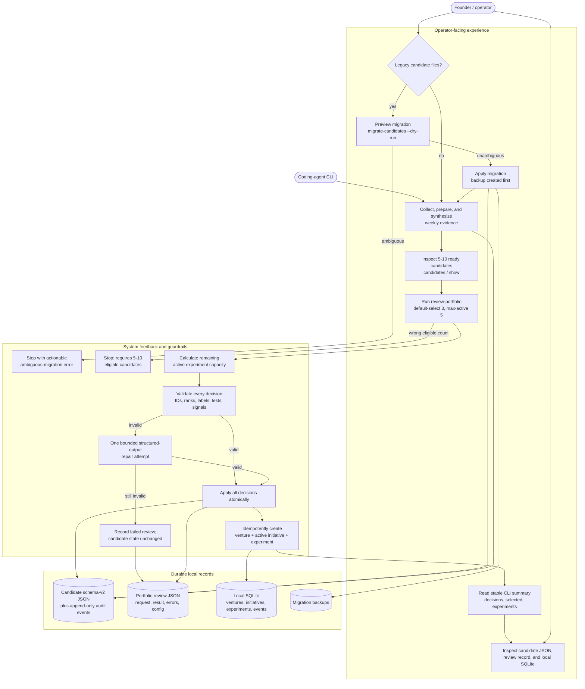
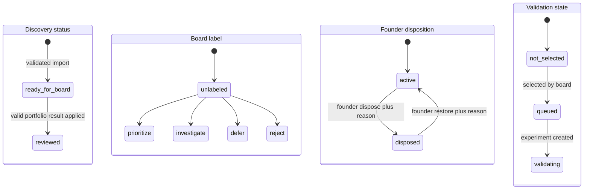

# Opportunity-to-Validation User Experience

This document describes the user experience implemented in Slice A. It is an
operator-facing CLI workflow, not yet a React dashboard. It stops at durable,
locally inspectable validation experiments and does not publish a real page or
post to social platforms.

For a filterable, clickable version of these graphs, open
`opportunity-validation-user-experience.html` directly in a browser.

## Experience at a glance



## Detailed interaction sequence

This sequence shows where the founder waits, what the system validates, and
which retries are safe.

```mermaid
sequenceDiagram
    autonumber
    actor F as Founder
    participant CLI as Discovery CLI
    participant CS as Candidate store
    participant XS as Experiment store
    participant B as Board orchestrator
    participant VS as Ventures / initiatives

    opt Existing schema-v1 candidates
        F->>CLI: migrate-candidates --dry-run
        CLI->>CS: inspect every candidate
        alt all mappings are deterministic
            CS-->>F: migration count; no writes
            F->>CLI: migrate-candidates --apply
            CLI->>CS: create timestamped backups, then write v2
            CS-->>F: migrated / unchanged counts and backup path
        else an ambiguous legacy record exists
            CS-->>F: stop with candidate-specific error
        end
    end

    F->>CLI: review-portfolio --week W --default-select 3 --max-active 5
    CLI->>CS: load active ready_for_board candidates
    alt fewer than 5 or more than 10
        CS-->>F: actionable eligibility-count error; no mutation
    else 5-10 eligible candidates
        CLI->>XS: count active experiments
        XS-->>CLI: available capacity, never above 5
        CLI->>B: bounded evidence summaries for the whole portfolio
        B-->>CLI: structured decision for every candidate
        CLI->>CLI: validate IDs, contiguous ranks, labels, assumptions,<br/>cheap tests, signals, stop conditions, exposure, selection limit
        alt structured result is invalid
            CLI->>B: one repair request containing validation error
            B-->>CLI: repaired structured result
        end
        alt result remains invalid
            CLI->>CS: do not change candidates
            CLI-->>F: failed review recorded and retry is safe
        else full result is valid
            CLI->>CS: atomically record every rank, label, rationale, and audit event
            loop Each selected candidate, normally top three
                CLI->>VS: get-or-create candidate venture and validation initiative
                VS-->>CLI: active initiative IDs
                CLI->>XS: create candidate + review unique experiment
                XS-->>CLI: day-7 review and day-14 expiry
                CLI->>CS: link validation state and experiment audit context
            end
            CLI-->>F: review ID, decision count, selected count, experiment count
        end
    end

    opt Founder repeats the same completed command
        F->>CLI: review-portfolio with same week and candidate set
        CLI->>CS: load completed idempotent review
        CLI->>XS: reuse candidate + review experiments
        CLI-->>F: same logical result without duplicate work
    end
```

## Candidate experience states

The founder sees independent dimensions instead of one overloaded status.
Board rejection does not delete a candidate. Founder disposal can be restored
without rewriting the board's historical opinion.



The schema also reserves founder `overridden` and validation outcome states for
later slices. Slice A does not expose founder override or experiment-review
commands, so those transitions are intentionally absent from this UX graph.

## What the founder can and cannot do today

| Experience | Slice A behavior |
| --- | --- |
| Preview legacy data changes | Available through migration dry-run |
| Retain a board-rejected candidate | Available; board rejection never deletes evidence or history |
| Restore a disposed candidate | Available through explicit founder restore with a reason |
| Compare a weekly portfolio | Available through `review-portfolio` for 5-10 candidates |
| See why every candidate ranked where it did | Persisted in candidate and portfolio-review JSON |
| Start validation work | Automatic for selected candidates within capacity |
| Retry safely | Completed reviews and experiments are idempotent |
| Inspect experiments | Local JSON/SQLite inspection; no dedicated experiment CLI or UI yet |
| Publish a landing page | Not available; fake publisher is test-only |
| Collect leads or metrics | Not available in Slice A |
| Generate or post social content | Not available in Slice A |
| Review everything in one dashboard | Not available until the founder UI slice |

## Failure language and recovery

- Migration ambiguity identifies the record and performs no migration writes.
- An ineligible weekly count reports the actual count and performs no review.
- A malformed board result gets one repair attempt. A second failure is stored
  as a failed review and candidate files remain unchanged.
- Capacity is resolved before board selection. The default selection limit is
  three and the active hard maximum is five.
- Repeating a completed review or experiment creation returns existing durable
  records rather than duplicating ventures, initiatives, or experiments.
- The fake-publisher service rejects any adapter marked external, keeping Slice
  A unable to publish accidentally.

## Next user-experience increment

Slice B adds a configured public landing/form trust zone, first-use setup
confirmation, lead retention/deletion rules, tracked events, and manual-first
distribution packets. Slice C then turns the local records described here into
the 15-30-minute founder dashboard and resumable weekly command.
