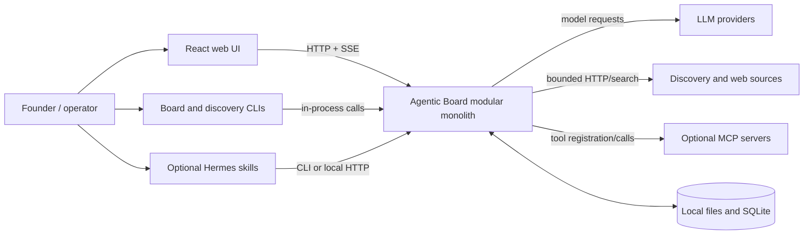
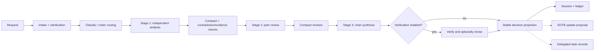

# System Graph

## System context

## Component and connection graph

Arrows mean “calls or reads from.” Dashed arrows are proposal, feedback, or
optional integration paths rather than mandatory synchronous dependencies.

```mermaid
flowchart TB
    subgraph Inbound[Inbound adapters]
      UI[React UI\nui/src]
      API[FastAPI API\nserver/api]
      BCLI[Board CLI\nserver/cli.py]
      DCLI[Discovery CLI\nserver/discovery/cli.py]
      HERMES[Hermes skills\nhermes/skills]
      CHANNELS[Messaging channels\nserver/channels]
    end

    subgraph Core[Governance and operations]
      BOARD[Board governance\nserver/board]
      EXEC[Execution\nserver/execution]
      EXPERIMENTS[Validation experiments\nserver/experiments]
      INIT[Initiatives\nserver/initiatives]
      MEMORY[Institutional memory\nserver/memory]
      HARNESS[Learning harness\nserver/harness]
      VENTURES[Ventures\nserver/ventures]
      DISCOVERY[Venture discovery\nserver/discovery]
      PROFILES[Profiles\nserver/profiles]
      EVALS[Offline evaluation\nevals]
    end

    subgraph Definition[Configuration and definition assets]
      MEMBERS[Member prompts\nserver/members]
      PROTOCOLS[Stage protocols\nserver/protocols]
      ROSTER[Roster + harness config]
    end

    subgraph External[External systems]
      LLM[LLM providers]
      WEB[Web/search/source APIs]
      MCPS[MCP servers]
    end

    subgraph Data[Local persistence]
      SESS[(data/sessions/*.json)]
      TASKS[(task/evidence JSON)]
      LEDGER[(harness SQLite + reviews)]
      SOTB[(SOTB Markdown/index/snapshots)]
      IDB[(initiatives SQLite)]
      VDB[(ventures SQLite)]
      DDATA[(discovery runs/reports)]
      XDB[(validation experiment SQLite)]
    end

    UI -->|HTTP/SSE| API
    HERMES -->|CLI/local HTTP| BCLI
    HERMES -.-> API
    CHANNELS -->|normalized commands| API
    BCLI --> BOARD
    BCLI --> HARNESS
    DCLI --> DISCOVERY
    API --> BOARD
    API --> EXEC
    API --> INIT
    API --> MEMORY
    API --> HARNESS

    BOARD --> MEMBERS
    BOARD --> PROTOCOLS
    BOARD --> ROSTER
    BOARD --> LLM
    BOARD --> MCPS
    BOARD --> WEB
    BOARD --> MEMORY
    BOARD -.->|delegation plan| EXEC
    BOARD -.->|session outcome| HARNESS
    BOARD --> SESS

    EXEC --> BOARD
    EXEC --> HARNESS
    EXEC --> VENTURES
    EXEC --> WEB
    EXEC --> TASKS
    INIT --> IDB
    INIT -->|links session/task IDs| SESS
    API -->|initiative task view| EXEC
    MEMORY --> LLM
    MEMORY --> HARNESS
    MEMORY --> SOTB
    HARNESS --> ROSTER
    HARNESS --> LEDGER
    VENTURES --> VDB
    DISCOVERY --> WEB
    DISCOVERY --> DDATA
    DISCOVERY -->|bounded portfolio review| BOARD
    DISCOVERY -->|selected candidates only| EXPERIMENTS
    EXPERIMENTS --> VENTURES
    EXPERIMENTS --> INIT
    EXPERIMENTS --> XDB
    PROFILES --> ROSTER
    EVALS --> BOARD
    EVALS --> HARNESS
```

## Deliberation pipeline

## Important boundaries

- Discovery collection/import does not call project LLMs. A separate explicit
  portfolio-review command sends only bounded evidence summaries to the board.
- Selected portfolio candidates create typed validation experiments only; no
  product build or general always-on execution is authorized.
- Board output can propose memory changes and delegated work. Durable memory
  mutation and external execution remain separately gated.
- Remote API access is disabled unless explicitly enabled; bearer auth is
  optional when remote mode is enabled.
- The harness may propose configuration changes, but review/approval/application
  are distinct operations.

The detailed founder journey, error branches, idempotent retry behavior, and
candidate state graph are documented in
`opportunity-validation-user-experience.md`.
